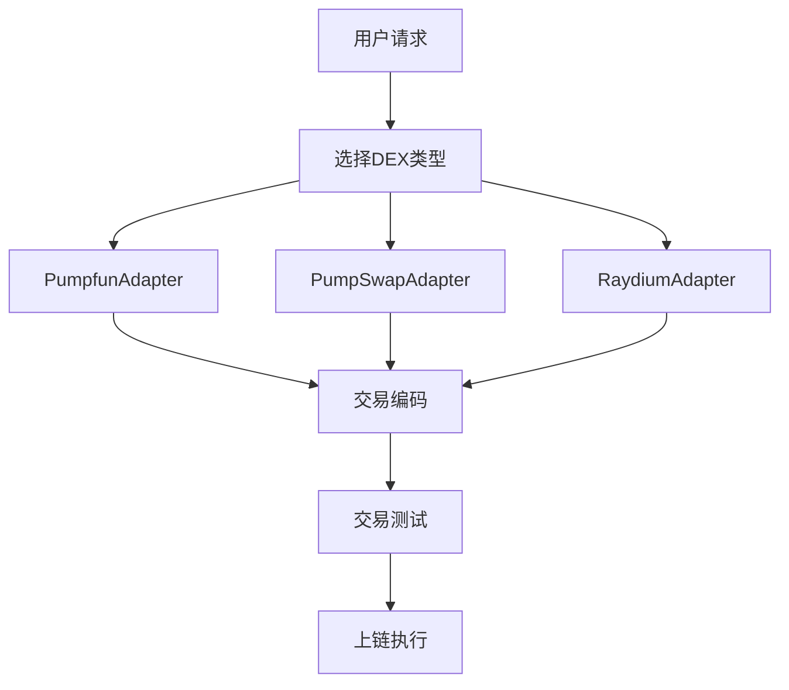

# Solana DEX交易编码服务 - 产品需求文档

## 1. 产品概述

本项目是一个基于Go语言开发的Solana区块链DEX交易编码服务，专门用于在多个去中心化交易所（DEX）上进行交易指令的编码、打包和上链操作。

- 主要解决Solana链上不同DEX交易指令格式差异化的问题，为开发者提供统一的交易编码接口
- 目标用户为需要在Solana链上进行自动化交易的开发者、量化交易团队和DeFi应用开发商
- 项目目标是成为Solana生态中最易用、最稳定的DEX交易编码工具库

## 2. 核心功能

### 2.1 用户角色

| 角色 | 使用方式 | 核心权限 |
|------|----------|----------|
| 开发者 | 直接调用API或SDK | 可以调用所有交易编码和测试功能 |
| 系统管理员 | 配置和监控 | 可以管理DEX配置、查看系统状态 |

### 2.2 功能模块

本服务包含以下核心页面和模块：

1. **交易编码模块**：支持多DEX交易指令编码，包括买入、卖出、流动性操作
2. **DEX适配器模块**：为不同DEX提供统一接口，支持Pumpfun、PumpSwap、Raydium
3. **交易测试模块**：提供完整的交易上链测试功能
4. **配置管理模块**：管理DEX配置、RPC节点配置等

### 2.3 页面详情

| 模块名称 | 组件名称 | 功能描述 |
|----------|----------|----------|
| 交易编码模块 | SwapEncoder | 编码代币交换交易指令，支持滑点设置、优先费用配置 |
| 交易编码模块 | LiquidityEncoder | 编码流动性添加/移除交易指令 |
| DEX适配器模块 | PumpfunAdapter | 适配Pumpfun DEX的交易格式和接口 |
| DEX适配器模块 | PumpSwapAdapter | 适配PumpSwap DEX的交易格式和接口 |
| DEX适配器模块 | RaydiumAdapter | 适配Raydium DEX的交易格式和接口 |
| 交易测试模块 | TransactionTester | 执行交易上链测试，验证交易有效性 |
| 配置管理模块 | ConfigManager | 管理DEX配置、RPC节点、私钥等敏感信息 |

## 3. 核心流程

### 主要操作流程：

1. **交易编码流程**：用户选择目标DEX → 输入交易参数 → 系统调用对应适配器 → 生成编码后的交易指令
2. **交易测试流程**：用户提供测试参数 → 系统编码交易 → 模拟执行或实际上链 → 返回测试结果
3. **DEX扩展流程**：开发新的DEX适配器 → 实现统一接口 → 注册到系统 → 测试验证

## 4. 用户界面设计

### 4.1 设计风格

- 主色调：深蓝色 (#1a1a2e) 和紫色 (#16213e)
- 按钮样式：圆角矩形，渐变色背景
- 字体：等宽字体用于代码显示，无衬线字体用于界面文本
- 布局风格：命令行界面风格，专业开发工具外观
- 图标风格：简洁的线性图标，符合区块链开发工具的专业感

### 4.2 页面设计概览

| 模块名称 | 组件名称 | UI元素 |
|----------|----------|--------|
| 交易编码模块 | SwapEncoder | 输入框（代币地址、数量）、下拉选择（DEX类型）、滑点设置滑块、编码按钮 |
| 交易测试模块 | TransactionTester | 测试参数表单、执行按钮、结果显示区域（JSON格式）、日志输出窗口 |
| 配置管理模块 | ConfigManager | 配置项列表、编辑表单、保存/重置按钮、状态指示器 |

### 4.3 响应式设计

本项目主要面向开发者，采用桌面优先的设计策略，支持命令行界面和Web界面两种交互方式。