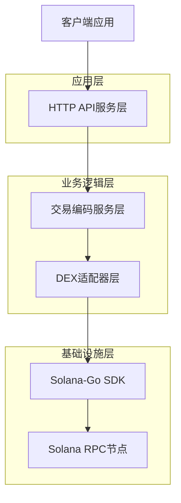
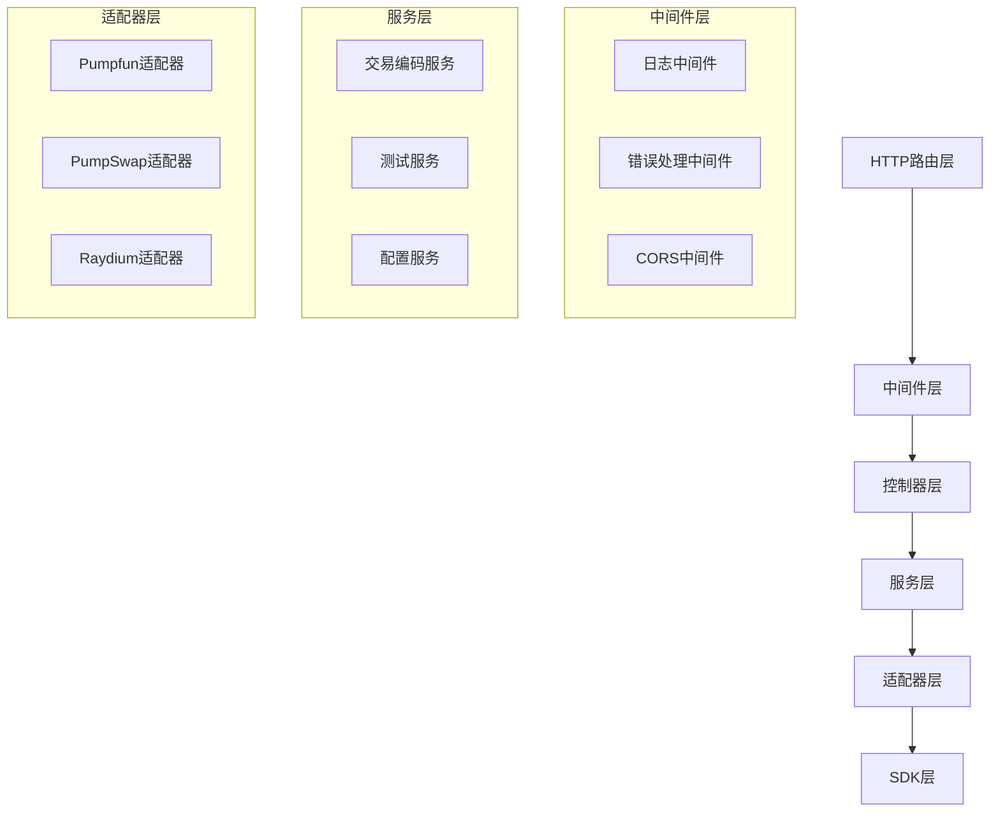
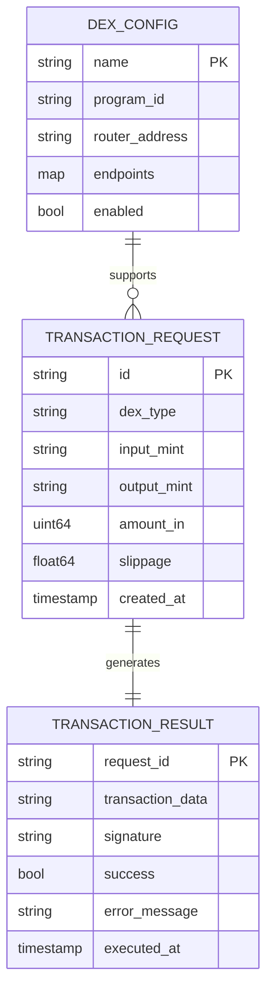

# Solana DEX交易编码服务 - 技术架构文档

## 1. 架构设计



## 2. 技术描述

- 后端：Go 1.21+ + Gin框架 + solana-go SDK
- 数据存储：本地配置文件（YAML/JSON）
- 外部依赖：Solana RPC节点、各DEX程序地址

## 3. 路由定义

| 路由 | 用途 |
|------|------|
| /api/v1/encode/swap | 编码代币交换交易 |
| /api/v1/encode/liquidity | 编码流动性操作交易 |
| /api/v1/test/transaction | 测试交易上链 |
| /api/v1/dex/list | 获取支持的DEX列表 |
| /api/v1/config | 配置管理接口 |
| /health | 健康检查接口 |

## 4. API定义

### 4.1 核心API

#### 代币交换编码
```
POST /api/v1/encode/swap
```

请求参数：
| 参数名 | 参数类型 | 是否必需 | 描述 |
|--------|----------|----------|------|
| dex_type | string | true | DEX类型（pumpfun/pumpswap/raydium） |
| input_mint | string | true | 输入代币地址 |
| output_mint | string | true | 输出代币地址 |
| amount_in | uint64 | true | 输入代币数量 |
| slippage | float64 | false | 滑点容忍度（默认0.5%） |
| priority_fee | uint64 | false | 优先费用（lamports） |

响应：
| 参数名 | 参数类型 | 描述 |
|--------|----------|------|
| success | boolean | 请求是否成功 |
| transaction | string | Base64编码的交易数据 |
| estimated_fee | uint64 | 预估交易费用 |

请求示例：
```json
{
  "dex_type": "raydium",
  "input_mint": "So11111111111111111111111111111111111111112",
  "output_mint": "EPjFWdd5AufqSSqeM2qN1xzybapC8G4wEGGkZwyTDt1v",
  "amount_in": 1000000000,
  "slippage": 0.005,
  "priority_fee": 5000
}
```

#### 交易测试
```
POST /api/v1/test/transaction
```

请求参数：
| 参数名 | 参数类型 | 是否必需 | 描述 |
|--------|----------|----------|------|
| transaction | string | true | Base64编码的交易数据 |
| simulate_only | boolean | false | 是否仅模拟执行 |
| private_key | string | true | 签名私钥（Base58编码） |

响应：
| 参数名 | 参数类型 | 描述 |
|--------|----------|------|
| success | boolean | 测试是否成功 |
| signature | string | 交易签名（如果实际执行） |
| logs | []string | 交易执行日志 |
| error | string | 错误信息（如果失败） |

## 5. 服务架构图



## 6. 数据模型

### 6.1 数据模型定义



### 6.2 数据定义语言

#### DEX配置结构
```go
type DEXConfig struct {
    Name          string            `yaml:"name" json:"name"`
    ProgramID     string            `yaml:"program_id" json:"program_id"`
    RouterAddress string            `yaml:"router_address" json:"router_address"`
    Endpoints     map[string]string `yaml:"endpoints" json:"endpoints"`
    Enabled       bool              `yaml:"enabled" json:"enabled"`
    CreatedAt     time.Time         `yaml:"created_at" json:"created_at"`
    UpdatedAt     time.Time         `yaml:"updated_at" json:"updated_at"`
}

type SwapRequest struct {
    ID          string    `json:"id"`
    DEXType     string    `json:"dex_type" binding:"required,oneof=pumpfun pumpswap raydium"`
    InputMint   string    `json:"input_mint" binding:"required"`
    OutputMint  string    `json:"output_mint" binding:"required"`
    AmountIn    uint64    `json:"amount_in" binding:"required,min=1"`
    Slippage    float64   `json:"slippage" binding:"min=0,max=1"`
    PriorityFee uint64    `json:"priority_fee"`
    CreatedAt   time.Time `json:"created_at"`
}

type TransactionResponse struct {
    Success      bool   `json:"success"`
    Transaction  string `json:"transaction,omitempty"`
    EstimatedFee uint64 `json:"estimated_fee,omitempty"`
    Error        string `json:"error,omitempty"`
}
```

#### 初始化配置数据
```yaml
# config/dex_config.yaml
dexes:
  - name: "raydium"
    program_id: "675kPX9MHTjS2zt1qfr1NYHuzeLXfQM9H24wFSUt1Mp8"
    router_address: "routeUGWgWzqBWFcrCfv8tritsqukccJPu3q5GPP3xS"
    endpoints:
      swap: "https://api.raydium.io/v2/sdk/swap"
      pools: "https://api.raydium.io/v2/sdk/liquidity/mainnet.json"
    enabled: true
    
  - name: "pumpfun"
    program_id: "6EF8rrecthR5Dkzon8Nwu78hRvfCKubJ14M5uBEwF6P"
    router_address: "39azUYFWPz3VHgKCf3VChUwbpURdCHRxjWVowf5jUJjg"
    endpoints:
      api: "https://pumpportal.fun/api"
    enabled: true
    
  - name: "pumpswap"
    program_id: "PSwapMdSai8tjrEXcxFeQth87xC4rRsa4VA5mhGhXkP"
    router_address: "PSwapRouterV1111111111111111111111111111111"
    endpoints:
      api: "https://api.pumpswap.com/v1"
    enabled: true
```